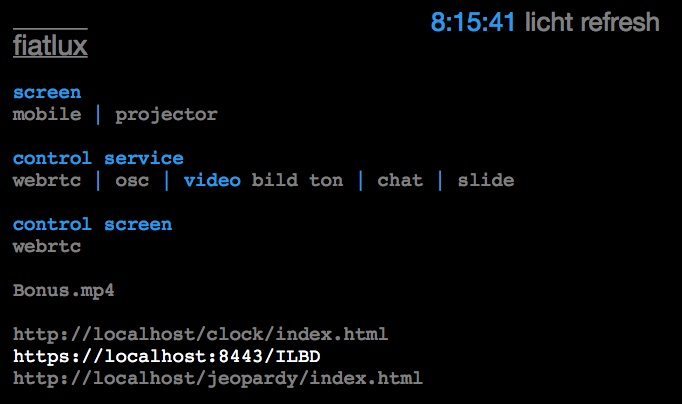

# projector
tired of changing from powerpoint to videoplayer to web browser in front of your audience?
or do you want to have the same screen on 50+ computers?

here is a universal browser based powerpoint(r) replacement  

copy all files to /Library/WebServer/Documents/projector  
export your powerpoint slides as jpg 2048x1536 pixel and  all  
other media files to /Library/WebServer/Documents/projector
(jpg, mp3, apple urls, ...)

```
sudo php -S 0.0.0.0:80 -t /Library/WebServer/Documents/projector -c /Library/WebServer/Documents/projector/php.ini
```

point your administrator browser to http://0.0.0.0/admin.php  (aka server)
point your display browser on the remote computer with projector attached to http://[adminip]/slide.php  (aka client)



the two links top right let the display refresh or go black  
all other media files are shown in the admin screen
  
note 1: chrome is the best display browser 
note 2: start the video manually (first time) with right click in display browser
note 3: can be easily expanded - use slide.php or video.php as an example
note 4: webrtc needs an additional browser plugin
